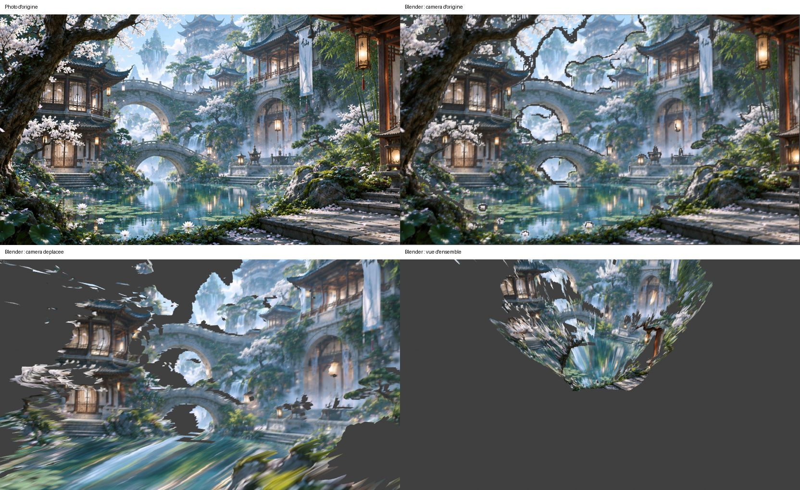

# InSpatio-World 1.5 — guide en français

Ce dépôt contient le code d'[InSpatio-World 1.5](https://github.com/inspatio/inspatio-world-v1.5)
(licence Apache-2.0, © InSpatio Team), copié tel quel à partir du commit `dd3561f`.
Le guide d'origine, en anglais, est dans [README.md](README.md).

Le modèle prend **une photo, quatre photos ou une vidéo** et génère une vidéo de la
même scène vue depuis une autre trajectoire de caméra.

Tu peux piloter cette caméra **dans Blender** : voir [Piloter la caméra depuis Blender](#piloter-la-caméra-depuis-blender).

## Ce qu'il te faut

| | Minimum conseillé |
|---|---|
| Carte graphique | NVIDIA, **16 Go de mémoire vidéo au moins, 24 Go ou plus conseillés** (non testé en dessous) |
| Système | **Linux** (Ubuntu 22.04 / 24.04). Sous Windows : passer par **WSL2** (voir plus bas) |
| Pilote NVIDIA | récent, compatible CUDA 12.6 (`nvidia-smi` doit afficher « CUDA Version: 12.6 » ou plus) |
| Disque | **~50 Go libres** (modèles + conversion + résultats) |
| Logiciels | `git`, `git-lfs`, `ffmpeg`, [Miniconda](https://docs.conda.io/en/latest/miniconda.html) |

Avec moins de 40 Go de mémoire vidéo, le programme garde automatiquement l'encodeur de texte
(le plus gros morceau) en mémoire vive et ne l'envoie sur la carte graphique qu'au besoin :
prévois donc aussi **32 Go de RAM** si possible.

### Windows : installer WSL2

Le projet utilise des scripts Linux (`bash`, `nvidia-smi`). Sous Windows 10/11 :

1. Mets à jour ton pilote NVIDIA (il gère CUDA dans WSL automatiquement).
2. Dans PowerShell **en administrateur** : `wsl --install -d Ubuntu-24.04`, puis redémarre.
3. Ouvre « Ubuntu » depuis le menu Démarrer et fais toute la suite dans ce terminal.
4. Vérifie que la carte est vue : `nvidia-smi`.

Ne réinstalle **pas** de pilote NVIDIA à l'intérieur d'Ubuntu/WSL.

## Installation (une seule fois)

```bash
# 1. Outils de base
sudo apt update && sudo apt install -y git git-lfs ffmpeg
git lfs install

# 2. Récupérer ce dépôt
git clone https://github.com/MaxiJoun/In-spatio.git
cd In-spatio

# 3. Environnement Python (télécharge PyTorch + CUDA, plusieurs Go)
conda env create -f environment.yml
conda activate inspatio_world_test
python -m pip install --no-deps depth-anything-3==0.1.1

# 4. Télécharger les modèles (~25 Go, ça peut prendre longtemps)
bash pipeline/download.sh
```

Si tu as une carte récente de type H100, tu peux installer FlashAttention-3 pour aller plus vite ;
sinon le programme utilise l'attention standard de PyTorch, ça marche sans.

## Lancer les exemples

```bash
conda activate inspatio_world_test
cd In-spatio

# Un seul exemple (le plus rapide pour tester) :
bash run_inference.sh --scene_dir examples/image_example_00

# Les six exemples fournis :
bash run_example.sh
```

Au premier lancement, l'encodeur de texte est converti au format `.safetensors` (une fois pour toutes).

Les résultats arrivent dans `output/<nom_de_la_scène>/` :

| Fichier | Contenu |
|---|---|
| `pred.mp4` | **la vidéo générée** — c'est le résultat |
| `source.mp4` | l'entrée d'origine |
| `render.mp4` | rendu brut de la nouvelle caméra (avec des trous) |
| `mask.mp4` | zones que le modèle a dû inventer |

## Utiliser ta propre vidéo

```bash
bash run_inference.sh --video /chemin/vers/ma_video.mp4 \
  --prompt "Description de la scène en anglais" \
  --target_traj /chemin/vers/target_tcw.txt
```

- La vidéo est redimensionnée en 832×480 automatiquement.
- La profondeur et les caméras d'origine sont estimées automatiquement (Depth-Anything-3).
- `target_tcw.txt` décrit la caméra voulue : **une ligne par image**, 16 nombres (matrice 4×4
  monde→caméra, convention OpenCV, lue ligne par ligne), dans le même repère que la caméra
  estimée de la première image. Le plus simple est de partir d'un des fichiers
  `examples/video_example_*/input/target_tcw.txt` (même nombre de lignes que d'images dans ta vidéo).

Pour tes propres photos (1 ou 4 images), il faut fournir en plus les cartes de profondeur et
les caméras : voir [examples/README.md](examples/README.md).

## Piloter la caméra depuis Blender

L'add-on `blender/inspatio_blender.py` affiche la scène en 3D dans Blender. Tu y animes une
caméra comme d'habitude, puis un bouton envoie sa trajectoire au modèle et ramène la vidéo
générée. Il n'y a pas de contrôle au clavier : c'est toi qui animes la caméra.



*En haut : la photo d'origine, puis la scène 3D vue par la caméra d'origine. En bas : la
caméra déplacée, puis une vue d'ensemble. Les zones grises n'existent pas sur la photo :
c'est le modèle qui les inventera.*

Il faut **Blender 4.2 ou plus récent** (testé avec 4.2 LTS et 5.0) et InSpatio installé comme
expliqué plus haut. Blender peut tourner sous Windows même si InSpatio est dans WSL.

### Installer l'add-on

1. Dans Blender : *Édition > Préférences > Modules complémentaires*. Clique sur la flèche ▾
   en haut à droite, puis *Installer depuis le disque…*, et choisis
   `blender/inspatio_blender.py`. Sous Windows, ce fichier se trouve dans l'explorateur à
   `\\wsl.localhost\Ubuntu-24.04\home\<toi>\In-spatio\blender\`.
2. Coche **InSpatio-World** et déplie ses réglages :

   | Réglage | Valeur |
   |---|---|
   | Exécution | *Linux (local)*, ou *Windows + WSL* si Blender est sous Windows |
   | Dossier In-spatio | chemin du dépôt. Sous WSL, mets le chemin Linux, par ex. `/home/<toi>/In-spatio` |
   | Python InSpatio | ce que renvoie `conda activate inspatio_world_test && which python`, par ex. `/home/<toi>/miniconda3/envs/inspatio_world_test/bin/python` |
   | Distribution WSL | le nom affiché par `wsl -l` dans PowerShell (par ex. `Ubuntu-24.04`) |

   Le message **« Configuration trouvée »** doit apparaître.

### Utiliser l'add-on

Dans la vue 3D, appuie sur **N** et ouvre l'onglet **InSpatio**.

1. **Scène.** Choisis un dossier de scène (par ex. `examples/image_example_00`) ou une vidéo.
   Pour une vidéo, ajoute une description en anglais. Clique sur **Préparer la scène**.
   - Pour une photo, ça prend quelques secondes.
   - Pour une vidéo, la profondeur et le trajet de la caméra sont d'abord estimés
     (Depth-Anything-3), ce qui prend quelques minutes la première fois.

   Blender affiche alors la photo « en relief », vue à travers la caméra **InSpatio_Camera**.
2. **Caméra.** Anime **InSpatio_Camera** :
   - **Photo(s) :** place la caméra, appuie sur **I** pour poser une clé, change d'image dans
     la timeline, déplace la caméra, **I**, et ainsi de suite. La plage de la timeline
     (*Début* / *Fin*) donne la durée de la vidéo générée. L'objet caché **Trajet_exemple**
     contient la trajectoire livrée avec l'exemple, si tu veux t'en inspirer.
   - **Vidéo :** la caméra est rattachée à **Trajet_source**, le trajet de la caméra
     d'origine. Si tu la déplaces ou la tournes, ce décalage s'applique pendant toute la
     vidéo. Pour un mouvement complètement libre, fais *Alt+P > Effacer le parent et garder
     la transformation*, puis anime-la. La plage doit couvrir toutes les images de la vidéo
     (le panneau indique laquelle).
   - Ne change pas la focale : le modèle utilise toujours celle de la source.
3. **Génération.** Clique sur **Générer la vidéo**. La progression s'affiche en bas du
   panneau, et le bouton **Journal** montre le détail. À la fin, la vidéo s'affiche en fond
   de la caméra (vue caméra : pavé numérique **0**) et **Ouvrir la vidéo** la lance.
   Chaque résultat est aussi copié dans `blender_scenes/<nom>/renders/`.

### Conseils

- Préfère des mouvements modérés : plus la caméra s'éloigne de ce que voit la photo, plus
  le modèle doit inventer.
- Les distances sont estimées à partir de la profondeur, en mètres approximatifs.
- La vidéo garde la cadence de la scène : 15 images/s pour les exemples photo, celle de
  la vidéo sinon.
- Sous WSL, **Arrêter** coupe Blender du calcul, mais le calcul peut continuer dans Ubuntu.
  Pour le stopper aussi : `pkill -f run_scene_inference` dans un terminal Ubuntu.

## En cas de problème

| Message | Solution |
|---|---|
| `nvidia-smi: command not found` / `No GPU is visible` | pilote NVIDIA absent ou, sous Windows, commandes lancées hors de WSL |
| `CUDA out of memory` | ferme les autres programmes qui utilisent la carte ; essaie d'abord `image_example_00` |
| erreur pendant `git lfs pull` | `git lfs install` puis relance `bash pipeline/download.sh` |
| plusieurs cartes graphiques | choisis-en une avec `--gpu 0` (ou 1, 2…), ou dans les préférences de l'add-on |
| Blender : « Configuration » en rouge | vérifie les trois chemins dans les préférences de l'add-on |
| Blender : « Modèles absents » | lance `bash pipeline/download.sh` |

## Licence

Code sous licence Apache-2.0 (voir [LICENSE](LICENSE)), auteurs : InSpatio Team.
Les dépendances (Depth-Anything-3, Wan2.1…) ont leurs propres licences.
Ajouts par rapport au projet d'origine : ce fichier `LISEZMOI.md`, la ligne d'en-tête de
`README.md`, l'add-on Blender (`blender/`, `tests/test_blender_bridge.py`,
`assets/blender/`) et une ligne dans `.gitignore`.
